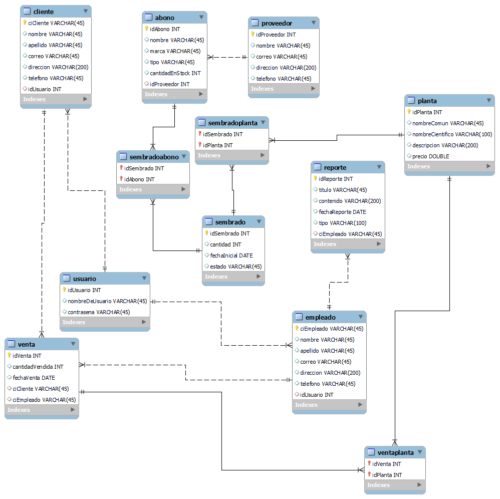

# Primer Proyecto Bases de Datos Avanzadas - Administración de Bases Datos - Base de Datos para el Vivero Municipal.

## Autor 👤:
-  **Nombre:** Marcos Andrés Simon Ágreda
-  **Código:** 56728
- **Semestre:** I-2023
- **Carrera:** Ingeniería de Sistemas Computacionales

## Descripción de la entidad y los requisitos 📝:

El presente proyecto, perteneciente al primer parcial del curso de Base de Datos Avanzadas de las Universidad Privada Boliviana, está centrado en la automatización, mediante la herramienta Docker-Compose, de tres servidores de bases de datos "MySQL", mediante los cuales, se pretende crear un proceso de replicación "Maestro-Esclavo", con un maestro y dos esclavos. Todo esto, para la creación de una base de datos para el Vivero Municipal de la ciudad de Cochabamba, especificado por la empresa pública: "EMAVRA" (Empresa Municipal de Áreas Verdes y Recreación Alternativa).

Dicho proyecto, con nombre: "Desarrollo De Software, Para Sistema De Información De Almacenes Y Gestión De Procesos Productivos De La Unidad De Viveros De Emavra", fue extraído de la página: [SICOES](https://www.sicoes.gob.bo/portal/index.php) (Sistema de contrataciones estatales), de dónde, su CUCE (Código Único de Contrataciones Estatales) es: **21-2303-00-1165439-1-1**. Dicha entidad, como su nombre lo indica, tiene como objetivo primordial, el desarrollo de un programa informático tipo software, mediante el cual, se maneje el control de inventarios de los almacenes de la unidad de viveros de la EMAVRA, para que de ésta manera, todos los procesos productivos que sean llevados a cabo en el Vivero Municipal de la EMAVRA, ubicado en la ciudad de Cochabamba, sean registrados y controlados de manera eficiente y eficaz.

De manera más específica, la orden de contratación de dicha entidad, brinda una serie de requisitos, los cuales se detallan a continuación:

- Módulo de Gestión de Procesos: El presente módulo, tal y como se encuentra detallado en la oferta del proveedor, solicita el registro de tanto: Sembrados, como abonos en el sistema.

- Módulo Venta de plantas: El presente módulo, solicita la posibilidad de la realización del registro y la eliminación de ventas de plantas (siendo las plantas, las que se encuentran disponibles en el propio Vivero Municipal).

- Módulo Proveedores de Insumo: El presente módulo, solicita la posibilidad de la realización del registro, modificación y eliminación de proveedores de insumos, junto a dichos insumos, además de la información relevante del propio proveedor de insumos.

- Módulo Mantención de Empleado: El presente módulo, solicita la posibilidad de la realización del registro y eliminación de empleados, junto a la información relevante del propio empleado.

- Módulo de Reportes: El presente módulo, solicita la posibilidad del registro de reportes ya existentes de diversos tipos: Como ser, reposrtes de producción, ventas, clientes, productos, categorías o inventarios.

- Módulo Reserva de Plantas: El presente módulo, solicita la posibilidad de la realización del registro y eliminación de las diversas plantas que se encuentran en virtud de ser reservadas por cliente, junto a la información relevante de la propia planta, siendo lo más importante, su stock.

- Módulo Mantención de Usuarios: El presente módulo solicita la posibilidad de la realización del registro, modificación y eliminación de usuarios, junto a la información relevante del propio usuario.

- Módulo Mantención de Clientes: El presente módulo solicita la posibilidad de la realización del registro, modificación y eliminación de clientes, junto a la información relevante del propio cliente.

- Módulo Gestión de Depóstio: El presente módulo, solicita la posibilidad de la realización del registro, modificación y eliminación de tanto los proveedores, como de los insumos que se mencionaron anteriormente, además de poder verificar la información relavente sobre los propios insumos.

Debido a que el presente proyecto, se limita al desarrollo de una arquitectura de base de datos; se realizaron pequeñas modificaciones en el proyecto de la EMAVRA, las cuales, fueron destinadas a limitar el Alcance del proyecto, a algo que pueda ser cumplido, simplemente realizando un esquema e implementación de bases de datos. En este caso, los cambios realizados fueron:

- Debido a la ambigüedad que trae el Módulo de Gestión de Procesos, se decidió dividir dicho módulo, en dos separados, los cuales son: Módulo de Sembrados y Módulo de Abonos.

- Debido a que el documento de contratación, no especifica de manera completa, cuales son los Insumos que manejan los Proveedores, se redujo a solamente un insumo, el ya mencionado Abono.

- Debido a que el módulo de reserva de Plantas, es demasiado ambigüo, en relación a lo que se debe almacenar en el sistema, se decidió que dicho módulo, simplemente guardaría información relevante sobre las plantas que se encuentran en el Vivero Municipal.

- Por último, debido a que el módulo de Gestión de Depósitos solamente trata el registro de Proveedores e Insumos (casos que ya se trataron en los módulos de Proveedores e Insumos de manera individual), se decidió eliminar dicho módulo.

Por lo tanto, ya con el alcance de los módulos bien definido, cada uno de éstos módulos, se decidió que sería representado por una Tabla en la Base de Datos, de tal manera, que la organización de dicha Base de Datos terminaría de la siguiente manera:

- sembrado:
    - idSembrado (PK)
    - cantidad
    - fechaInicial
    - estado

- abono:
    - idAbono (PK)
    - nombre
    - marca
    - tipo
    - cantidadEnStock
    - idProveedor (FK)

- venta:
    - idVenta (PK)
    - cantidadVendida
    - fechaVenta
    - ciCliente (FK)
    - ciEmpleado (FK)

- proveedor:
    - idProveedor (PK)
    - nombre
    - correo
    - direccion
    - telefono

- reporte:
    - idReporte (PK)
    - titulo
    - contenido
    - fechaReporte
    - tipo
    - ciEmpleado (FK)

- empleado:
    - ciEmpleado (PK)
    - nombre
    - apellido
    - correo
    - direccion
    - telefono
    - idUsuario (FK)

- planta
    - idPlanta (PK)
    - nombreComun
    - nombreCientifico
    - descripcion
    - precio

- usuario:
    - idUsuario (PK)
    - nombreUsuario
    - contrasena

- cliente:
    - ciCliente (PK)
    - nombre
    - apellido
    - correo
    - direccion
    - telefono
    - idUsuario (FK)    

Finalmente, debido a diversas relaciones entre las distintas tablas, se añadieron un total de 3 tablas más, las cuales son:

- sembradoabono:
    - idSembrado (PK, FK)
    - idAbono (PK, FK)

- sembradoplanta:
    - idSembrado (PK, FK)
    - idPlanta (PK, FK)

- ventaplanta:
    - idVenta (PK, FK)
    - idPlanta (PK, FK)    

## Diagrama propuesto de Base de Datos 📁

## Requisitos Técnicos 📋

Para poder ejecutar el proyecto, los requisitos varían dependiendo del sistema operativo en el que se lo debe ejecutar:

- Windows:

    - Tener instalado Docker Desktop, el cual puede ser descargado desde el siguiente link: https://www.docker.com/products/docker-desktop. Una vez descargado, se debe ejecutar el instalador, y seguir los pasos que se indican en el mismo.
    - Tener instalado Windows Subsystem for Linux (WSL), el cual, puede ser instalado mediante la ejecución del siguiente comando en PowerShell (como administrador):  `wsl --install` (al mismo tiempo, dicho comando instalará Ubuntu 20.04 LTS, el cual es el sistema operativo que se utilizará para ejecutar el proyecto).
    - Configurar Docker Desktop para que utilice WSL 2 como motor de contenedores, lo cual puede ser realizado, en Docker Desktop, en la pestaña de Settings, y luego en Resources, y finalmente en WSL Integration.
    - Se puede verificar la instalación de Docker, mediante la ejecución del siguiente comando en la terminal correspondiente a la distribución Ubuntu de WSL: `docker --version`.

- Mac:

    - Si la MAC utiliza un chip Intel, se necesita una versión de Mac OS X 10.15 o superior.
    - Si la MAC utiliza un chip Apple silicon, se recomienda tener insalado Rosetta 2, el cual puede ser instalado mediante la ejecución del siguiente comando en la terminal: `softwareupdate --install-rosetta`.
    - Tener instalado Docker Desktop, el cual puede ser descargado desde el siguiente link: https://www.docker.com/products/docker-desktop. Una vez descargado, se debe ejecutar el archivo Docker.dmg, y llevar el icono de Docker a la carpeta de Aplicaciones. Posteriormente, abrir Docker desde la carpeta de Aplicaciones.
    - Se puede verificar la instalación de Docker, mediante la ejecución del siguiente comando en la terminal: `docker --version`.

- Linux (Prefereiblemente Ubuntu o Debian):
    
    - Tener instalado Docker, lo cual puede ser realizado mediante la ejecución del siguiente comando en la terminal: `sudo apt-get install docker`.
    - Se puede verificar la instalación de Docker, mediante la ejecución del siguiente comando en la terminal: `docker --version`.    

Un requisito global para todos los sistemas operativos, es tener instalado Git, el cual puede ser obtenido de https://git-scm.com/

## Como levantar localmente el proyecto 🚀

Para poder levantar el proyecto localmente, se debe seguir los siguientes pasos:

1. Clonar el repositorio, mediante la ejecución del siguiente comando en la terminal: `git clone`. Si no se tiene instalado Git, se puede descargar el repositorio de manera directa.

2. (Paso solo para Windows) Se debe mover la carpeta, dentro de la cual se encuentra el repositorio, hacia el almacenamiento de la distribución Ubuntu, para esto, se puede posicionar la carpeta del repositorio, en la raíz de C:, y luego, en la terminal de Ubuntu, ejecutar el siguiente comando: `mv /mnt/c/<nombreCarpetaRepositorio> /home/<nombreUsuario>/`.

3. Posicionar la terminal dentro de la carpeta del repositorio, y ejecutar el siguiente comando: `docker-compose up -d`.

4. Se debe esperar a que los tres contenedores se levanten; este proceso habrá terminado en el punto en el que los contenedores: slave_marcos y slave_marcos_2; ambos muestren el mensaje: /usr/sbin/mysqld: ready for connections. Version: '8.0.25'  socket: '/var/run/mysqld/mysqld.sock'  port: 3306  MySQL Community Server - GPL. (Además, se debe haber mostrado en la terminal el SHOW SLAVE STATUS de ambos contenedores esclavos).

5. Abrir otra terminal, y para entrar al contenedor master_marcos, ejecutar el siguiente comando: `docker exec -it master_marcos mysql -p`.
6. Para acceder a la base de datos, se debe introducir el comando `use vivero;`.

## Importante ❗

- El nombre de la base de datos es: vivero
- Los nombres de los contenedores son: master_marcos, slave_marcos y slave_marcos_2.
- Las contraseñas root para los contenedores master_marcos, slave_marcos y slave_marcos_2, son para todos: 123456789.

    

